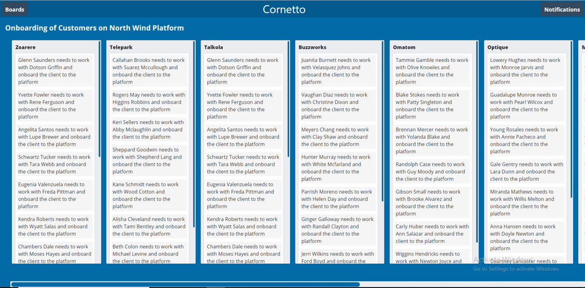

## Practice

### Resolve Impedance Mismatch in Task-Board Renderer

#### Context

##### About Kriya

Kriya is an application to manage and track tasks. 

Kriya has three components:

- Task Board: Task Board is a board which represents a Project or a place to keep track of information.
- Task List: Lists within Task Board represents various stages of progress. 
	- They can be used to create a workflow where cards are moved across list from start to finish
- Cards: The fundamental unit of a board is a card. Cards are used to represent tasks and ideas.
    - A card is something which needs to be done.


##### Kriya - Bootstrap Phase

Kriya, in it's bootstrapping phase made use of a normalized data structure for it's backend, which as follows:
- BoardId, BoardName, BoardDescription
- ListId, BoardId, ListName
- CardId, ListId, BoardId, CardTitle
- CommentId, CardId, CommentText, Timestamp

##### Kriya - Phase 2

Kriya overtime have now developed a Task Board Render, which can display the data in the following format.



#### Challenge

The input format of data used by Kriya in bootstrapping phase is not the same as the one expected by new Kriya.

##### Input Format of Data

```javascript

sample = {
    "boards": [{
        "boardId": 11,
        "boardTitle": "Product Rating Analysis"
    }],
    "lists": [{
        "listId": 9,
        "listTitle": "Product 1",
        "boardId": 11
    },
    {
        "listId": 99,
        "listTitle": "Product 2",
        "boardId": 11
    },
    {
        "listId": 8,
        "listTitle": "Product 3",
        "boardId": 10
    }
    ],
    "cards": [
        {
            "cardId": 12,
            "cardTitle": "Rating in Q1",
            "listId": 99
        },
        {
            "cardId": 14,
            "cardTitle": "Rating in Q2",
            "listId": 9
        },
        {
            "cardId": 16,
            "cardTitle": "Rating in Q3",
            "listId": 8
        }
    ],
    "comments": [
        {
            "commentId": 1001,
            "commentText": "Met the budget",
            "cardId": 12
        },
        {
            "commentId": 1002,
            "commentText": "Failed to meet the expectation.",
            "cardId": 14
        },
        {
            "commentId": 1003,
            "commentText": "Always in Demand",
            "cardId": 16
        },
    ]
}
```

##### Expected Data Format

```javascript

expectedOutput = {
    "boardId": 11,
    "boardTitle": "Product Rating Analysis",
    "lists": [{
        "listId": 9,
        "listTitle": "Product 1",
        "cards": [{
            "cardId": 14,
            "cardTitle": "Rating in Q2",
            "comments": 1
        }]
    },
    {
        "listId": 99,
        "listTitle": "Product 2",
        "cards": [{
            "cardId": 12,
            "cardTitle": "Rating in Q1",
            "comments": 1
        }],
    }]
};
```


Note: 
- Here **Input Format** *IS NOT EQUAL TO* **Expected Format**, resulting in **Impedance Mismatch**
- **Data Wrangling** process helps to resolve Impedance Mismatch.

#### Problem Statement

Resolve Impedence Mismatch for Kriya by providing Data Wrangling (Transformation) Logic, to transform the data structure of data stored in backend to the one used by Task Board Renderer.

#### Instructions

1. Download and unzip the boilerplate code.  
2. Run the command `npm install` to install the dependencies required for automated testing.  
3. Open the boilerplate code in VSCode to develop the assignment solution.
4. Provide the solution code within the `transform()` function of file `transformer.js`.
5. Launch the `index.html` page on the browser to view the rendered output
6. Correct logic will produce the rendered output with boards, lists and cards data as shown in image above.
7. Also test the solution locally by running the command `npm run test`.  
8. Refactor the solution to ensure all test cases are passing.  
9. DO NOT MODIFY THE PROVIDED CODE, ELSE THIS MAY THE IMPACT BROWSER OUTPUT AS WELL AS THE TEST CODE EXECUTION.

## Submitting your solution for preliminary automated review  

 1. Open https://codereview-wipro.stackroute.in/#/app and login into the platform  
 2. Under Assignment repository select `resolve-impedance-mismatch-in-task-board-renderer`, and branch master  
 3. Under Your solution repository select your own repository and branch  
 4. Press Submit  
 5. Evaluation will take around 2 mins to complete after which you need to refresh your browser and get the updated status    
 6. Press click here for the feedback 
 7. Watch out for your total score and detailed status on each test and eslint errors in the coloured blocks on the screen  
 8. Fix failing test cases as well as eslint errors and re-submit your solution until you get 100%

