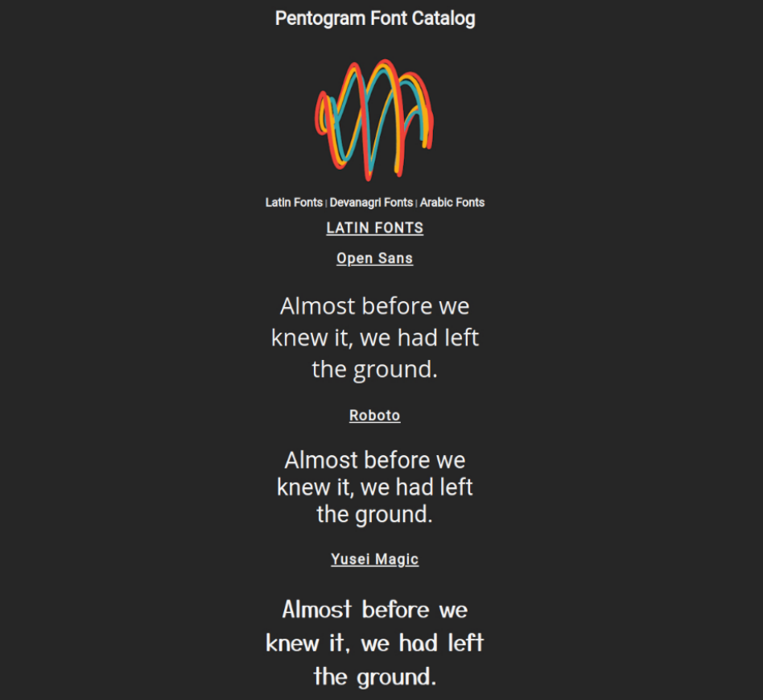

# Pentogram Font Catalog Preview Challenge

## Context

Pentogram is the world’s largest independently owned design studio. It is owned and run equally by 25 partners—all of whom are leaders in the design industry. The design studio is headquartered in London and has offices spread across Austin, Berlin, New York, and San Francisco. Graphic designers spread across different locations are usually posed with the challenge of finding fonts created by their peers. 

## Challenge

The team at Pentogram tried to build a catalog of fonts such that the fonts can be easily located and viewed by the graphic designers. But the font catalog created isn’t helping graphic designers much. ​

Now, the team is given the task to modify the design in such a way that it is easier for the graphic designers to understand the geometry of fonts.​

- Create a single point of reference that provides preview of fonts to help designers compare different fonts using CSS3 selectors and properties.

​

- The catalog of the font specimen can be found at fonts.google.com/specimen/{font+family}, for example, Open Sans font can be found at `fonts.google.com/specimen/Open+Sans`.

- The complete preview could be seen in this [PDF](./Pentogram-Font-Catalog-Preview.pdf)