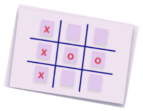

## Challenge

### Develop Tic-Tac-Toe Game

#### Context

Alice is the principal of a kindergarten school in Dover, Delaware, U.S.A. 

The young kids in her school are smart and intelligent, and Alice wants them to excel in all fields and decided to run an intensive learning program for them. 

As a part of the program, Alice wants the young kids to be trained in computers. Hence, she has decided to use web games for the kids to help the kids learn computer but in a fun way. 

One of these games is an interactive Tic Tac Toe web game that two kids can play on the same computer. 

The game must have a replay option that plays the kids' recorded moves so that Alice and her staff can later review the moves of the kids and help them learn and grow accordingly. 

#### Problem Statement

Develop a 2-player 3x3 Tic Tac Toe game with a feature of replaying the game.

#### Instructions

1. Download and unzip the boilerplate code.  
2. Run the command `npm install` to install the dependencies required for automated testing.  
3. Open the boilerplate code in VSCode to develop the assignment solution.
4. Provide the solution code within the file `script.js`.
5. Launch the `index.html` page on the browser to view the rendered output.
6. Run the command `npm run lint` to test the code for hygiene checks.
7. Refactor the solution to ensure all test cases are passing.  
8. DO NOT MODIFY THE PROVIDED CODE, ELSE THIS MAY IMPACT THE TEST CODE EXECUTION.

## Submitting your solution for preliminary automated review  

 1. Open https://codereview-wipro.stackroute.in/#/app and login into the platform  
 2. Under Assignment repository select `develop-tic-tac-toe-game`, and branch master  
 3. Under Your solution repository select your own repository and branch  
 4. Press Submit  
 5. Evaluation will take around 2 mins to complete after which you need to refresh your browser and get the updated status    
 6. Press click here for the feedback 
 7. Watch out for your total score and detailed status on each test and eslint errors in the coloured blocks on the screen  
 8. Fix failing test cases as well as eslint errors and re-submit your solution until you get 100%
