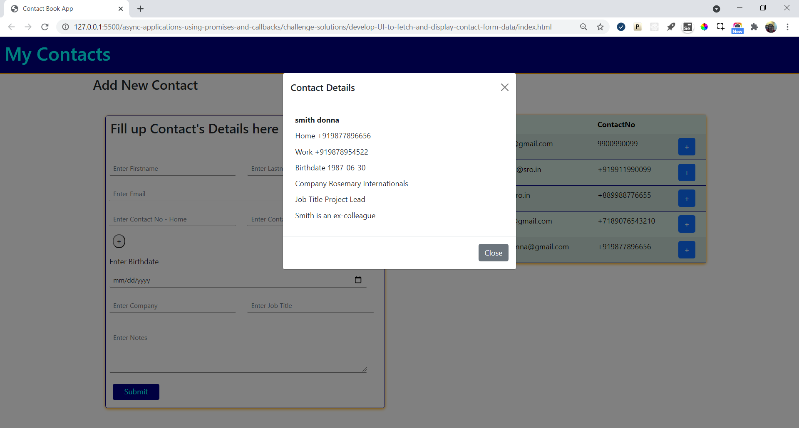

## Challenge

### Develop UI to Fetch and Display Contact Form Data

#### Context

Prime solutions is an IT solutions provider company who have earned reputation in providing IT solutions in different business domains

Recently they have received a project to develop contact book app.

Prime solutions have approached Graffitti designers for a good UI design.

The design is ready and now it needs to be made functional.

The development will be carried out in stages.

In the first two stages, inputs are captured, validated and posted to server.

In the third stage of development, you as a frontend developer have to fetch the data and display it on UI

##### Contact Form

Graffitti Designers have designed contact form that allows app users to provide inputs

#### Challenge

The contact form currently has fields that captures basic contact details.

However, more fields can be added going forward

For a lengthy form, it would not be recommended to display entire details of a contact on the page.

Instead for a cleaner UI, it would be better to display the key details such as name, email and one of the contact nos.

More details can be provided when user opts for it.

Hence, the UI should be accordingly developed and populated.

#### Problem Statement

Fetch the details stored from contacts.json file through json-server

Display the key details, such as 

- FirstName
- LastName
- Email
- Home Contact No

The contact list should be arranged in the alphabetical order by the firstname

The contact list should be displayed in tabular format as suggested below:

More contact details should be displayed in a modal view, once the + button is clicked, as suggested below.

#### Instructions

1. Download and unzip the boilerplate code.  
2. Run the command `npm install` to install the dependencies required for automated testing.  
3. Open the boilerplate code in VSCode to develop the assignment solution.
4. Provide the solution code within the file `script.js`.
5. Bootstrap framework should be used for responsive table and modal layouts
6. Launch the `index.html` page on the browser to view the rendered output.
7. Test the solution locally by running the command `npm run test`.
8. Refactor the solution to ensure all test cases are passing.  
9. DO NOT MODIFY THE PROVIDED CODE, ELSE THIS MAY IMPACT THE TEST CODE EXECUTION.

## Submitting your solution for preliminary automated review  

 1. Open https://codereview-wipro.stackroute.in/#/app and login into the platform  
 2. Under Assignment repository select `develop-ui-to-fetch-and-display-contact-form-data`, and branch master  
 3. Under Your solution repository select your own repository and branch  
 4. Press Submit  
 5. Evaluation will take around 2 mins to complete after which you need to refresh your browser and get the updated status    
 6. Press click here for the feedback 
 7. Watch out for your total score and detailed status on each test and eslint errors in the coloured blocks on the screen  
 8. Fix failing test cases as well as eslint errors and re-submit your solution until you get 100%
